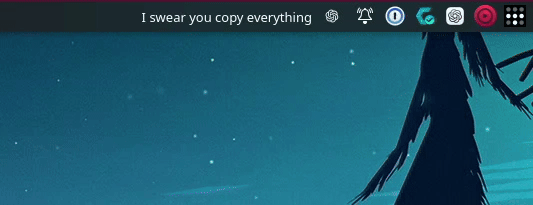

# KLyric

> Synchronized Apple Music lyrics from Cider, right in your KDE Plasma panel.

KLyric connects [Cider](https://cider.sh/) to a lightweight KDE Plasma 6 widget.
The Cider plugin reads the active synchronized lyric line, a local bridge keeps
only the current state in memory, and the widget renders it in your panel.



## Features

- Active synchronized lyrics in a compact Plasma panel widget.
- Configurable one-to-three-line popup and alignment-aware icon layout.
- Clear playback, lyric-availability, Cider, and bridge states.
- Recovery across Cider, bridge, Plasma, and session restarts.
- Authenticated loopback-only communication with no lyric persistence.
- Release-based installation plus update, uninstall, version, and help commands.
- Theme-aware horizontal and vertical Plasma 6 layouts with RTL support.

## Requirements

- Linux with KDE Plasma 6
- Cider 2.5 or newer
- Bun 1.3.14 or newer
- `curl`, `sha256sum`, `tar`, `unzip`, `kpackagetool6`, and user systemd

KLyric is validated with Cider 3.1.8-1 and Plasma 6.7.2 on Wayland. Cider's
Lyrics view must currently remain open for live synchronized lyric extraction.

## Installation

Install or upgrade the latest GitHub Release:

```bash
curl -fsSL https://raw.githubusercontent.com/Lfmpaes/klyric/main/install.sh | bash
```

This release-facing command becomes available after the v0.1.1 installer is on
`main` and matching release assets are published. The installer operates only in
the current user account and does not add the widget to a panel automatically.

## First use

1. Restart Cider, open **Extensions → Plugins**, and enable **KLyric**.
2. Retrieve the local publisher token in a private terminal:

   ```bash
   ~/.local/bin/klyric-bridge token show
   ```

3. Enter the token in KLyric's Cider plugin settings.
4. Open a synchronized track and Cider's **Lyrics** view.
5. Add **KLyric** through Plasma panel edit mode.

Never share the publisher token in screenshots, issues, or support requests.

## Documentation

- [Installation, management, paths, and troubleshooting](docs/installation.md)
- [Runtime testing and compatibility](docs/testing.md)
- [Architecture](docs/architecture.md)
- [Bridge behavior and security](docs/bridge.md)
- [Protocol contract](docs/protocol.md)
- [Cider extraction research](docs/cider-research.md)
- [Release notes](RELEASE_NOTES.md)

## Development

```bash
bun install
bun run format
bun run lint
bun run typecheck
bun run test
bun run build
```

## License

KLyric is released under the [MIT License](LICENSE).
