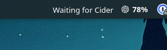

# KLyric

> Synchronized Apple Music lyrics from Cider, right in your KDE Plasma panel.

KLyric connects [Cider](https://cider.sh/) to a lightweight KDE Plasma 6 widget.
The Cider plugin reads the active synchronized lyric line, a local bridge keeps
only the current state in memory, and the widget renders it in your panel.
Everything stays on your machine.



<!-- Add product screenshots here when available.


-->

## Features

- Displays the active synchronized lyric line in a compact Plasma widget.
- Supports one or more widgets connected to the same local bridge.
- Recovers from Cider, Plasma, and bridge restarts.
- Provides compact horizontal and vertical panel layouts.
- Keeps playback and lyric state local and in memory only.
- Uses an authenticated, loopback-only bridge for local communication.
- Includes bounded text rendering, fallback states, RTL support, and theme-aware UI.

## Requirements

- KDE Plasma 6
- Cider 2.5 or newer
- Bun 1.3.14 or newer for the release installer
- A track with synchronized lyrics available in Cider

KLyric is developed and tested on Cider 3.1.8 and Plasma 6.7.2. Cider's Lyrics
view must currently be open while using the DOM lyric source. This is a Cider
compatibility limitation and is documented in the [integration matrix](docs/integration-testing.md).

## Installation

Download the release archive from the project's Releases page, verify its
checksum, extract it, and run the local installer:

```bash
sha256sum --check SHA256SUMS
tar -xzf klyric-0.1.0.tar.gz
cd klyric-0.1.0
bun run install:local --source .
```

The installer installs the bridge, systemd user service, Cider plugin, and
Plasma widget for the current user. It does not modify system files or add a
widget to a panel automatically.

For the complete installation, upgrade, uninstall, and troubleshooting guide,
see [docs/installation.md](docs/installation.md).

## First use

1. Start or restart Cider.
2. Open **Extensions → Plugins** and enable **KLyric**.
3. Open the KLyric plugin settings and enter the local bridge token.
4. Retrieve the token privately with:

   ```bash
   ~/.local/bin/klyric-bridge token show
   ```

   Never share this token in screenshots, issues, or support requests.

5. Open a track with synchronized lyrics and open Cider's **Lyrics** view.
6. Enter Plasma panel edit mode and add **KLyric**.

The widget displays a connection or availability message when the bridge is
stopped, Cider is disconnected, or the current track has no lyrics.

## Updating and uninstalling

Install a newer release over the existing installation using the same command.
KLyric keeps the bridge token and creates backups of replaced user files.

To remove KLyric while preserving settings:

```bash
bun run uninstall:local
```

To remove the application and its settings, including the publisher token:

```bash
bun run uninstall:local --purge
```

## Privacy and security

KLyric does not fetch lyrics from third-party services, upload playback data, or
persist complete lyric catalogs. The bridge binds to loopback only, requires a
publisher token for writes, validates protocol messages, and stores the latest
state in memory.

Do not include bridge tokens, account information, or complete lyric text in
bug reports. See the [release readiness audit](docs/release-readiness.md) for
the detailed privacy, security, dependency, and artifact review.

## Troubleshooting

Check the bridge and its user service:

```bash
systemctl --user status klyric-bridge.service
curl --fail http://127.0.0.1:37654/health
```

If the bridge is not running:

```bash
systemctl --user daemon-reload
systemctl --user restart klyric-bridge.service
```

If lyrics are unavailable, confirm that the Lyrics view is open in Cider and
that the current track provides synchronized lyrics. For more help, see
[docs/installation.md](docs/installation.md) and
[docs/integration-testing.md](docs/integration-testing.md).

## Documentation

- [Installation and troubleshooting](docs/installation.md)
- [Release notes](RELEASE_NOTES.md)
- [Bridge, protocol, and token behavior](docs/bridge.md)
- [Integration matrix and limitations](docs/integration-testing.md)
- [Release readiness audit](docs/release-readiness.md)
- [Cider extraction research](docs/cider-research.md)

## Development

```bash
bun install
bun run format
bun run lint
bun run typecheck
bun run test
bun run build
```

The project uses Bun, strict TypeScript, Biome, and Plasma 6 tooling. See the
project documentation and existing package scripts when contributing.

## License

KLyric is released under the [MIT License](LICENSE).
